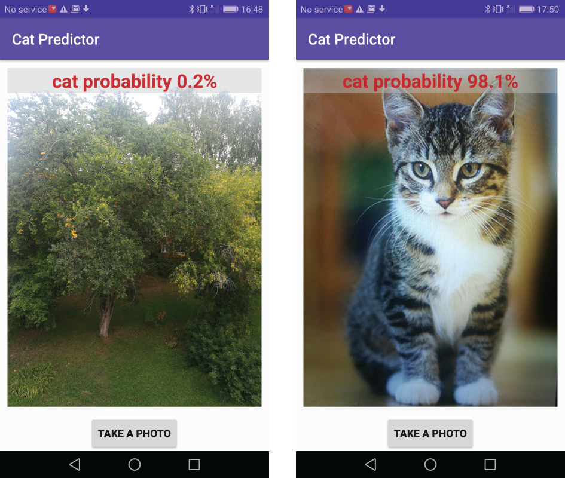
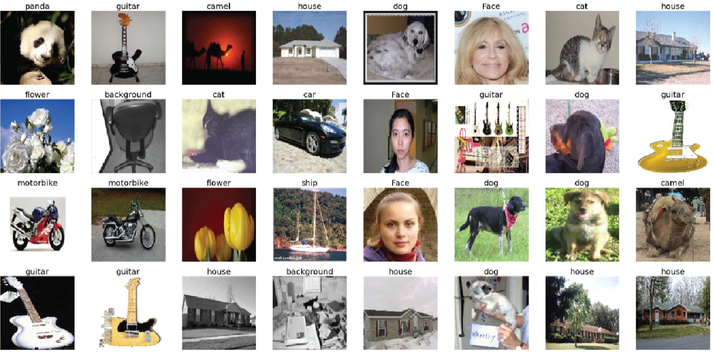
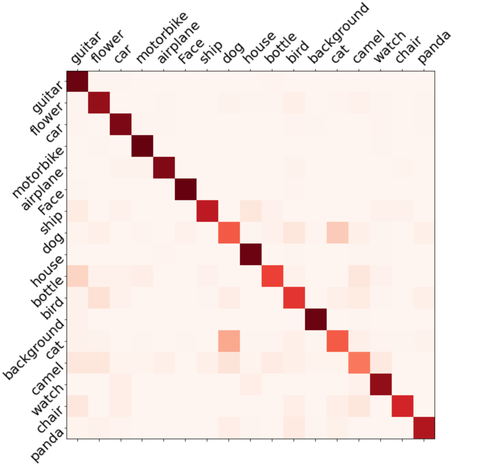
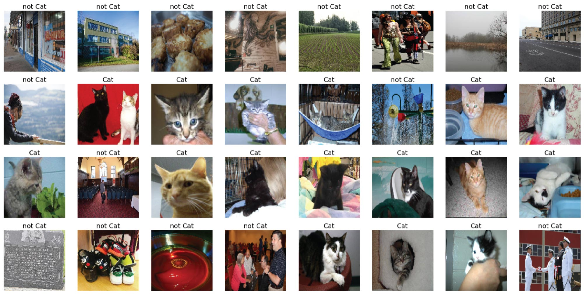

# Cat-Predictor
This project represents the integration of TensorFlow Lite into Android application. 
The application allows to take photos and predict probability of cats. The picture below shows two examples of application screenshots.

  

## Project structure
* The "Android App" directory contains Android Studio project.
* The "Tensorflow model" directory contains Jupyter notebooks with TensorFlow implementation of the model including code for conversion into Tensorflow Lite model.

## Model architecture and training process
The MobileNetv2 architecture was used as a base model. It was trained on Tesla K80 GPU (Kaggle).
* Firstly, the MobileNetv2 model (notebook "MobileNetv2_training.ipynb") was trained on [**dataset containing 17 different classes**](https://www.kaggle.com/davidbirdy/17categories) including: guitar, flower, car, motobike, airplane, face, 
ship, dog, house, bottle, bird, background, cat, camel, watch, chair and panda. The figure below illustrates images examples from this dataset.

  

* As a result, the MobileNetv2 model average precision, recall and F1 scores are 0.806, 0.802, and 0.802, respectively. The following picture shows the confusion matrix.

  

* Secondly, the top layer of the MobileNetv2 model was removed and a Dense layer with one neuron was added instead, in order to perform binary classifcation between cats and not cats (notebook "main_model_training.ipynb"). This "main" model was trained on [**dataset containing images with and without cats**](https://www.kaggle.com/davidbirdy/catsnotcats). Images for "not cat" class was taken from [**Open Images Object Detection RVC 2020 edition**](https://www.kaggle.com/c/open-images-object-detection-rvc-2020/overview). The figure below illustrates images examples from "Cats - not Cats" dataset.

  

* The final model accuracy, precision, recall and F1 scores are 0.925, 0.984, 0.865 and 0.920, correspondingly :rocket:.
